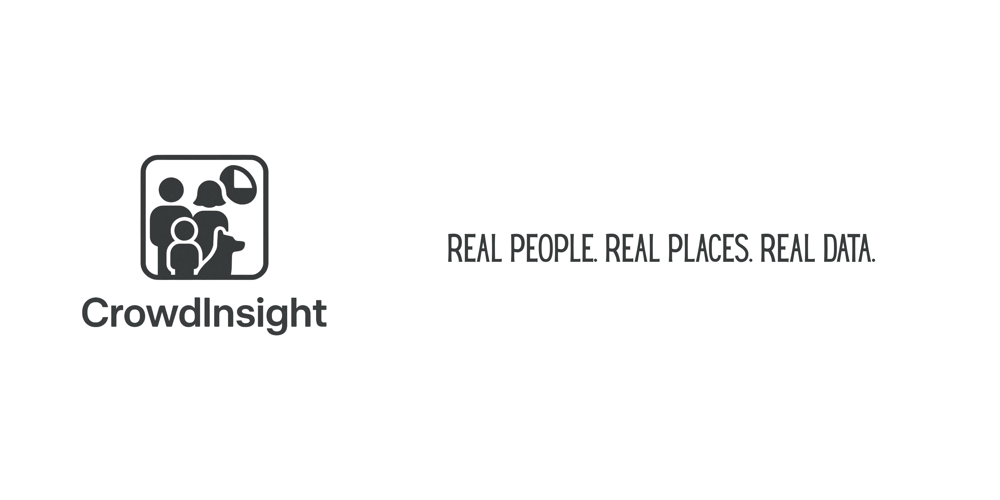

<p align="center">
  
</p>

# CrowdInsight

**Know your crowd. Shape your space.**

CrowdInsight is a Python AI library that converts CCTV footage or live streams into meaningful insights. It detects and classifies entities like adults, children, men, women, and animals (e.g., dogs), tracks movement, and generates structured data for real-world applications — from retail stores to government buildings.

---

## 📁 Project Structure

```bash
CrowdInsight/
│
├── crowdinsight/             # Core Python package
│   ├── __init__.py
│   ├── analyzer.py           # Main interface (CrowdAnalyzer class)
│   ├── detector.py           # Object detection logic (YOLOv8, etc.)
│   ├── tracker.py            # Person tracking module (DeepSORT, ByteTrack)
│   ├── utils.py              # Helper functions
│   ├── visualizer.py         # Draw boxes, labels, etc.
│   └── config.py             # Configuration settings
│
├── examples/                 # Example scripts
│   ├── analyze_video.py
│   └── analyze_live.py
│
├── assets/                   # Branding, logos, sample media
│   └── CrowdInsight.png
│
├── videos/                   # Sample video files (for local tests)
│   └── cctv.mp4
│
├── outputs/                  # Output results (CSV, JSON, images)
│   └── output.csv
│
├── tests/                    # Unit tests
│   └── test_analyzer.py
│
├── README.md                 # Project overview and instructions
├── requirements.txt          # Required Python packages
└── setup.py                  # PyPI packaging file
```

---

## 🚀 Features

- 🎥 Video file & live webcam/IP stream support
- 🧠 Real-time object detection and classification
- 📍 Visitor tracking using DeepSORT/ByteTrack
- 📊 Structured analytics export (CSV/JSON)
- ⚙️ Modular and extensible for custom use cases

---

## 📦 Installation

```bash
pip install crowdinsight
```

> ⚠️ Note: This project is currently in development and not yet on PyPI.

---

## 💡 Example Usage

### ▶️ Analyze a Video File

```python
from crowdinsight import CrowdAnalyzer

analyzer = CrowdAnalyzer(video_path="videos/cctv.mp4")
results = analyzer.run_analysis()

print(results.summary())
results.export_csv("outputs/output.csv")
```

### 📡 Analyze a Live Stream

```python
from crowdinsight import CrowdAnalyzer

analyzer = CrowdAnalyzer(video_source=0)  # 0 = webcam or use IP cam RTSP
analyzer.run_live_stream()
```

---

## 🧠 Technology Stack

- YOLOv8 / YOLO-NAS (object detection)
- DeepSORT / ByteTrack (object tracking)
- Pre-trained CNNs (age/gender estimation)
- OpenCV, PyTorch, Ultralytics

---

## 📊 Sample Output (JSON)

```json
{
  "timestamp": "2025-05-27T15:00:00",
  "summary": {
    "total_visitors": 73,
    "adults": 49,
    "children": 12,
    "males": 37,
    "females": 28,
    "dogs": 5
  },
  "hourly_breakdown": {
    "09:00": {"visitors": 10},
    "10:00": {"visitors": 21},
    "11:00": {"visitors": 42}
  }
}
```

---

## 🧪 Testing

Run all unit tests:

```bash
pytest tests/
```

---

## 🗺️ Roadmap

- [ ] Video file analysis
- [ ] Live stream support
- [ ] Basic demographic tracking
- [ ] Real-time anomaly detection
- [ ] Web dashboard integration (next stage)
- [ ] REST API (FastAPI)
- [ ] Deployment container (Docker)

---

## 🎯 Target Use Cases

- 🏪 **Retail**: Understand customer flow and demographics
- 🏨 **Hospitality**: Improve service based on real visitor data
- 🏛️ **Public Sector**: Monitor and analyze usage of public spaces
- 🐾 **Pet-Friendly Spaces**: Identify non-human traffic too

---

## 🤝 Contributing

Got ideas? Found bugs? Want to collaborate?
We welcome contributions!  
Please open an issue or submit a pull request.

---

## 📄 License

**MIT License**  
Free to use, share, and modify with attribution.

---

> Built with ❤️ to bridge the physical world and data intelligence.
